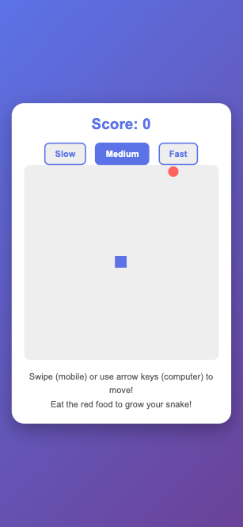
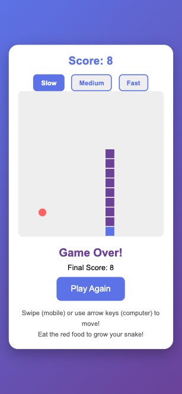

# 🐍 Snake Game

A simple, fun Snake game that works on both mobile phones and computers! 🎮

## 📖 About

This is a classic Snake game where you control a snake that grows longer as it eats food. The goal is to eat as much food as possible without crashing into the walls or yourself! 🍎

## ✨ Features

- 📱 **Mobile & Desktop Support** - Play with swipe gestures on mobile or arrow keys on computer
- ⚡ **Speed Settings** - Choose from Slow, Medium, or Fast speeds
- 🛡️ **Safe Controls** - Can't move backwards and crash into yourself
- 🎨 **Simple Design** - Clean, colorful interface that's easy to use
- 🚀 **No Installation** - Just open in your web browser and play!

## 🎮 How to Play

### 📱 On Mobile
- Swipe **up** ⬆️ to move the snake up
- Swipe **down** ⬇️ to move the snake down
- Swipe **left** ⬅️ to move the snake left
- Swipe **right** ➡️ to move the snake right

### 💻 On Computer
- Press **↑** (up arrow) to move up
- Press **↓** (down arrow) to move down
- Press **←** (left arrow) to move left
- Press **→** (right arrow) to move right

### 🏆 Game Rules
- 🍎 Eat the red food to grow your snake and earn points
- ⚠️ Don't hit the walls or crash into yourself
- 🎯 Try to get the highest score!

## 🚀 How to Run

1. 📥 Download the `index.html` file
2. 🌐 Open it in any web browser (Chrome, Safari, Firefox, etc.)
3. ▶️ Start playing!

## 🌍 How to Deploy

Upload the `index.html` file to any web hosting service. That's it! The game is completely self-contained in one file. ✅

## 📸 Screenshots

<!-- Add your screenshots here -->

### 🎮 Main Game Screen

### 💀 Game Over Screen

## 🛠️ Technologies Used

- HTML5
- CSS3
- JavaScript (Vanilla)
- Canvas API for game graphics

## 📄 License

Free to use and modify! 🎉
